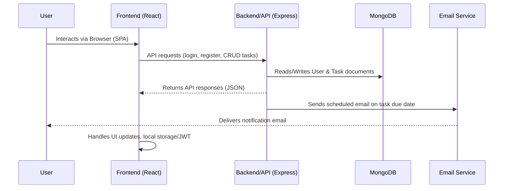

# Task Tracker Monolithic Application – Architecture Overview

## Introduction

The Task Tracker Monolithic Application is a unified platform for task management, enabling users to efficiently organize personal or team-oriented tasks. The entire application—including the frontend UI, backend API, business logic, and data storage—resides within a single repository and deployable container.

This document provides a comprehensive overview of the application's architecture, summarizing major system components, technology stack, internal interfaces, feature coverage, and key design choices. Included alongside the textual overview is a set of Mermaid diagrams visualizing the system structure and its internal relationships.

---

## Technology Stack

- **Frontend:** React JS (SPA), JavaScript, CSS (custom themes, responsive design)
- **Backend:** Express.js (Node.js), RESTful APIs
- **Database:** MongoDB (via Mongoose ODM)
- **Other:** JWT authentication (jsonwebtoken), bcrypt (password hashing), nodemailer (email notifications), dotenv (env config), CORS middleware
- **Testing:** Jest, Supertest, React Testing Library, jest-axe (accessibility)
- **Deployment:** Monolithic container (web + backend packaged together), configuration via `.env`

---

## High-Level Architecture

```mermaid
graph TD
    A[User<br/>(Web/iPhone Browser)] -- HTTP/HTTPS --> B[React Frontend<br/>(SPA)]
    B -- REST API Calls --> C[Express Backend/API]
    C -- Mongoose --> D[(MongoDB)]
    C -- SMTP/Email --> E[Email Service<br/>(SMTP Server)]
    B -- Shared Modules --> C
    subgraph "Monolithic Container"
      B
      C
    end
```

- **User** interacts via responsive web or iPhone browsers.
- All business logic and UI served from a single monolithic application container.
- **React frontend** communicates with the **Express backend** over RESTful APIs.
- Backend connects to **MongoDB** for persistent storage and sends email notifications via an external SMTP service.
- Shared code (utilities/constants) is accessible across both frontend and backend.

---

## Major Components

### 1. **Frontend Application (`/frontend`, `/src`)**
- **Entry point:** `src/index.js`, main app in `src/App.js`
- **UI/UX:** Single Page Application styled with responsive CSS in `src/App.css`, adapting for both desktop and mobile (iPhone) browsers.
- **Features:**
  - Login/Registration screen and authenticated dashboard
  - Task list rendering, task CRUD forms, status/priority/due-date display
  - Task creation/edit/deletion/completion (buttons/actions)
  - Theme switching (light/dark mode)
  - Form inputs for authentication and tasks
  - Drag-and-drop email-to-task creation (API support, UI placeholder)
  - Accessible and responsive design verified with automated tests
- **API Layer:** `src/api.js` provides abstraction of all backend communication and JWT handling.

### 2. **Backend Application (`/backend`)**
- **Server Entry:** `backend/server.js`
- **Express Middleware:**
  - CORS
  - JSON body parsing
  - Route mounting: `/api/auth`, `/api/tasks`
- **Routes:**
  - **Auth (`routes/auth.js`)**: Register, Login, Logout (JWT-based, stateless)
  - **Tasks (`routes/tasks.js`)**: CRUD operations, completion, filtering, schedule email notifications
- **Models:**
  - **User (`models/User.js`)**: Email (unique), name, passwordHash (bcrypt), role, timestamps.
  - **Task (`models/Task.js`)**: Title, description, dueDate, status (todo/in_progress/completed), priority, assigned user/creator, timestamps.
- **Database:** Mongoose connects to MongoDB using URI from `.env`
- **Email Notification:** Uses nodemailer and SMTP credentials from `.env` to send due date reminders 24 hours before a task is due.

### 3. **Shared Code (`/shared`)**
- Shared modules (e.g., constants, validation logic) for use by both frontend and backend. Placeholder for future logic; currently minimal.

---

## RESTful API Interfaces

```mermaid
flowchart TD
    F[Frontend UI (React)]
    subgraph Backend API (Express)
      direction LR
      A1[/api/auth/register/]
      A2[/api/auth/login/]
      A3[/api/auth/logout/]
      T1[/api/tasks/]
      T2[/api/tasks/:id/]
      T3[/api/tasks/:id/complete/]
      T4[/api/tasks/:id/schedule-email/]
    end
    F -- register/login/logout --> A1 & A2 & A3
    F -- CRUD/Filter tasks --> T1
    F -- View/Update/Delete task --> T2
    F -- Toggle complete --> T3
    F -- Email reminder --> T4
```

- **/api/auth/register:** Create user account
- **/api/auth/login:** Obtain JWT token
- **/api/auth/logout:** Stateless, client-clears token
- **/api/tasks:** List (with filters), create tasks
- **/api/tasks/:id:** Get, update, delete a task
- **/api/tasks/:id/complete:** Toggle completion status
- **/api/tasks/:id/schedule-email:** Trigger manual reminder email

**Authentication**: All task-related endpoints require Bearer token (JWT) authorization.

---

## Feature Coverage Matrix

| Feature                | Frontend | Backend | Database | Email Service | Notes                                   |
|------------------------|:--------:|:-------:|:--------:|:-------------:|------------------------------------------|
| User Auth (JWT)        |   ✓      |   ✓     |    ✓     |       —       | Login/register/logout                    |
| Task CRUD              |   ✓      |   ✓     |    ✓     |       —       | Create, read, update, delete             |
| Task Completion        |   ✓      |   ✓     |    ✓     |       —       | Toggle status todo/completed             |
| Task Filtering/Sorting |   ✓      |   ✓     |    ✓     |       —       | By status, priority, and due date        |
| Due Date Notifications |   —      |   ✓     |    ✓     |      ✓        | Auto email 24h before due date           |
| Drag & Drop Email      |   ✓      |   •     |    ✓     |       —       | UI placeholder, backend supports         |
| Responsive UX          |   ✓      |   —     |    —     |       —       | CSS + tests for web and iPhone           |
| Accessibility          |   ✓      |   —     |    —     |       —       | Verified by automated test (`jest-axe`)  |

Legend: ✓ = implemented; • = partial support; — = not applicable

---

## System Design Choices

- **Monorepo Monolithic Setup:** All components (frontend, backend, and shared code) exist in a single workspace, simplifying dependency management, consistency, CI/CD, and deployments.
- **React SPA:** Allows for a dynamic, interactive, and mobile-responsive interface, with all routes and state managed client-side.
- **Express REST API:** Provides clear separation between client and server responsibilities, ensuring scalability and maintainability.
- **JWT Authentication:** Ensures stateless, scalable user session management. Credentials are never persisted client-side.
- **MongoDB via Mongoose:** Facilitates flexible, document-based storage for both users and tasks—ideal for evolving requirements.
- **Email Notification Integration:** Offloaded to backend using nodemailer, enabling timely alerts with configuration via `.env`.
- **Testing:** Comprehensive testing covers integration (backend APIs with Jest and Supertest), frontend flows (integration and accessibility with React Testing Library), and error scenarios to promote reliability.
- **Environment Variables:** All secrets and deployment-specific parameters are defined in `.env`, never hard-coded.

---

## Component Interaction Summary



---

## Internal Directory Structure

```
TaskTrackerMonolithicApplication/
  backend/
    models/    # Mongoose models: User.js, Task.js
    routes/    # Express route handlers: auth.js, tasks.js
    tests/     # Jest/Supertest backend tests
    server.js  # Express entry point
    package.json
  frontend/
    package.json  # React-specific dependencies
  shared/
    index.js      # Shared utilities/constants
  src/
    App.js/App.css # Main UI and styles
    api.js        # API utility functions
    __tests__/    # Frontend tests: integration, accessibility
```

---

## System Integration and Deployment

- The **monolithic container** bundles the frontend UI and backend API, exposing a single service endpoint.
- Environment variables in `.env` define all sensitive credentials (MongoDB URI, JWT secret, SMTP config).
- The backend serves static assets (frontend build) as needed in production setups.
- Email notifications are decoupled from user actions, triggered by backend logic on due date conditions.
- All code and configuration for deployment reside in the same repository and are deployed as one unit.

---

## Conclusion

The Task Tracker Monolithic Application is purpose-built for rapid task management with a developer-friendly and scalable architecture. Its clear modular separation (yet monolithic deployability), extensive test coverage, and modern technology choices guarantee maintainability, security, and extensibility for future feature growth.

---

_Last updated: 2024-06-07_
